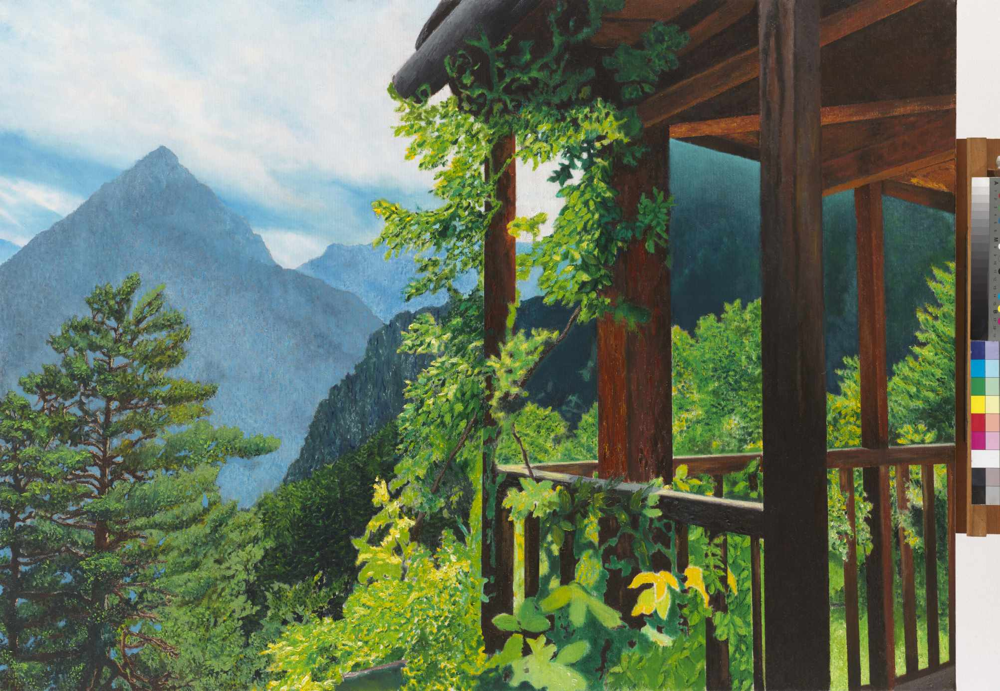
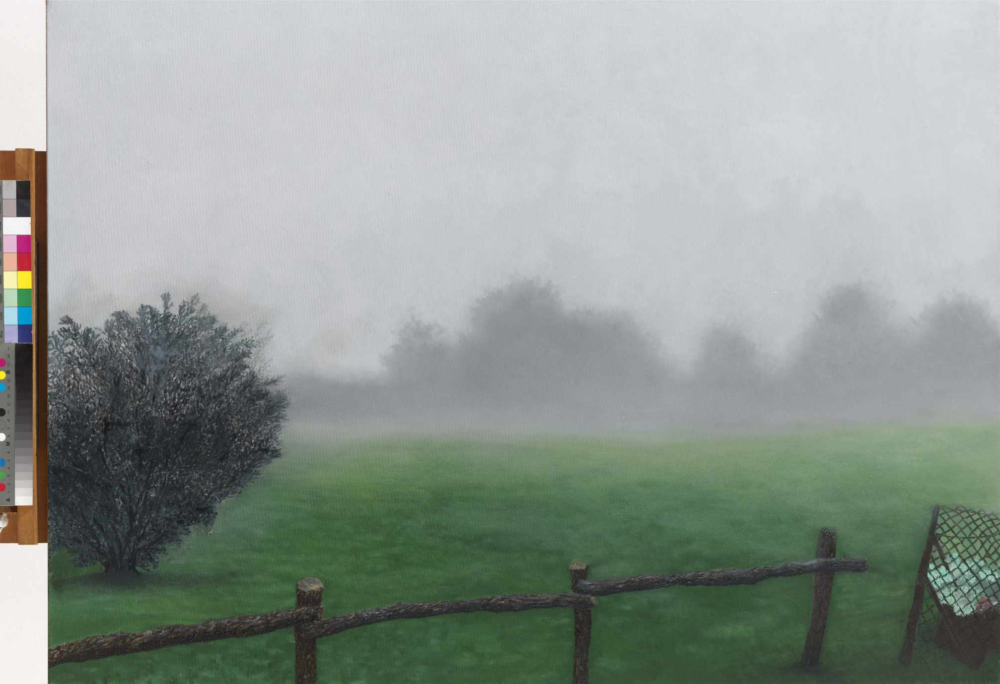

# Trip to Trasquera

**Sigrid Nassuphis**

[βιογραφικο](./assets/biography/bio.txt)

## Εργα  

### Trasquera 1

A winding path through a verdant valley leads towards a snow-capped mountain in this vibrant painting. 
The green grass and trees contrast sharply with the white snow, creating a dynamic scene. 
The path symbolizes a journey through the natural landscape, inviting viewers to explore its beauty.

90 x 120 cm

### Trasquera 2

A commanding mountain peak dominates this composition, framed by detailed bushes and trees in the foreground. 
The clear blue sky contrasts with the rugged textures of the mountain, highlighting its majestic presence. 
This work captures the formidable beauty of the alpine environment.

120 x 90 cm

### Trasquera 3

In this painting, the artist depicts the panoramic beauty of Bugliaga di Trasquera. 
The towering pines in the foreground contrast with the distant, snow-capped peaks. 
The careful detailing of the rocky mountains and lush evergreens showcases the grandeur of the alpine landscape. 
This work captures the tranquil majesty of nature, inviting viewers to appreciate its serene beauty.

185 x 300 cm

### Trasquera 4

90 x 120 cm

### Trasquera 5

A quaint stone cottage is nestled amidst lush greenery in this vibrant painting. 
The bright colors of the grass and trees are complemented by a clear blue sky. 
The detailed fence in the foreground guides the viewer’s eye towards the serene home. 
This work reflects the peaceful simplicity of rural life.

90 x 120 cm

### Trasquera 6

In this misty landscape, the artist captures the ethereal beauty of foggy surroundings. 
Indistinct shapes of trees and bushes blend into the soft, muted tones of the background. 
The simple fence provides structure to the scene. 
This painting evokes a dreamlike quality, reflecting the transient nature of the mist.

90 x 120 cm

### Trasquera 7

This dramatic landscape features dark mountains under a turbulent sky. 
Thick clouds part to reveal glimpses of blue, adding depth to the scene. 
A small stone building in the foreground provides a human touch. 
This painting captures the powerful presence of nature and its ever-changing moods.

120 x 90 cm

### Trasquera 8

120 x 90 cm

### Trasquera 9

120 x 90 cm

### Trasquera 10

120 x 90 cm

## Κατάλογος:

Διαστάσεις

Αριθ, Αντιτύπων

Κείμενα Κριτικής

Βιογραφικά Κείμενα

Τίτλοι και διαστάσεις έργων

## Πρόσκληση:

Διαστάσεις

Αριθ, Αντιτύπων

Κείμενο Πρόσκλησης

