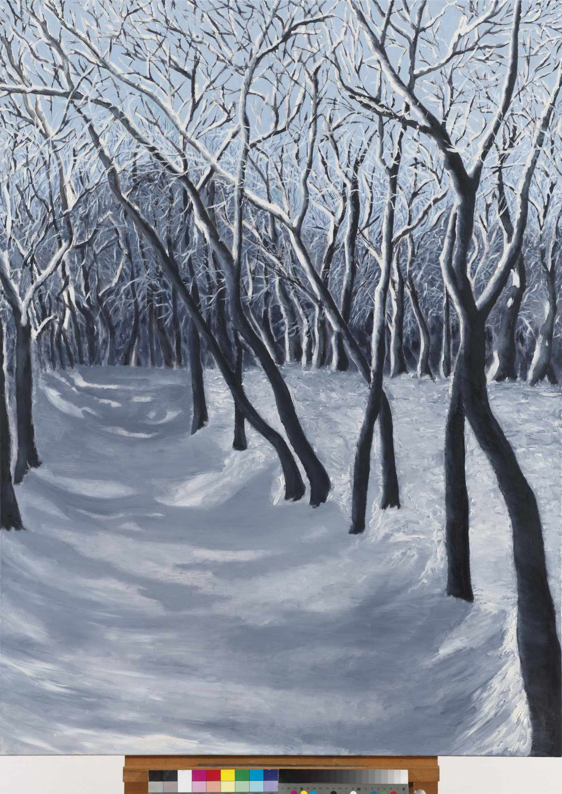
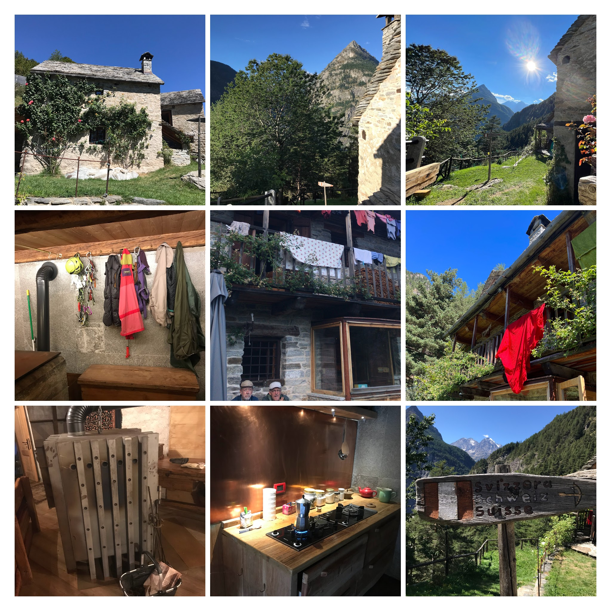
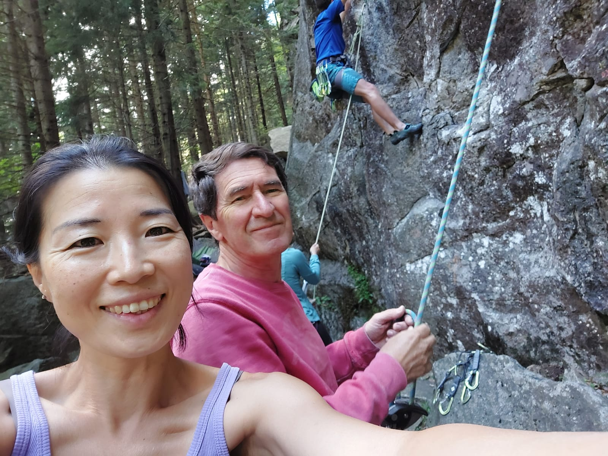
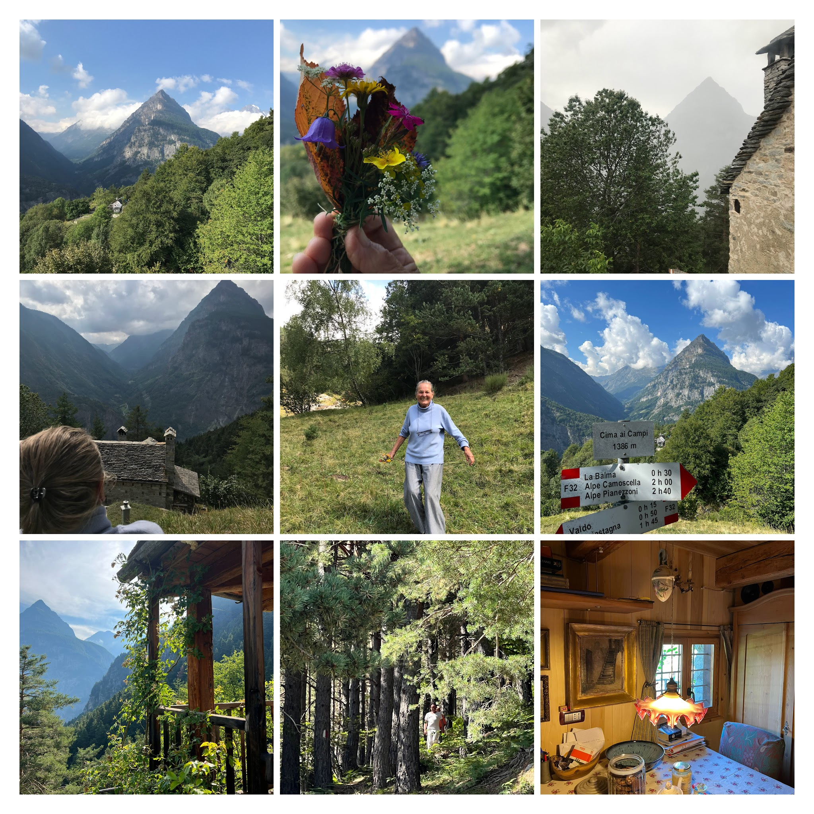
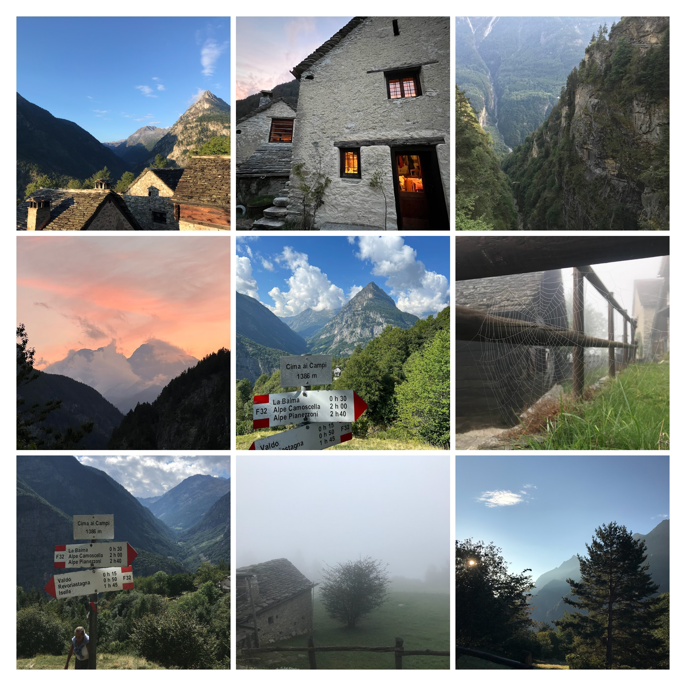
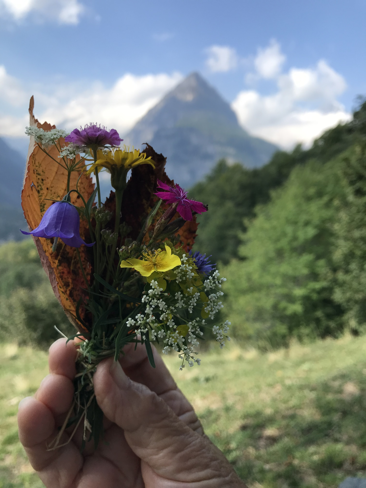

# Trip to Trasquera
(placeholder title)

**Sigrid Nassuphis** (b. 1940)

## Introduction

In March 2022, my father, Sigrid's beloved husband, passed away.
I spent most of that year keeping her company. In September, we embarked on an 
extended trip to Bugliaga di Trasquera—a magical place kept alive and thriving 
largely thanks to my wonderful friends, Antonio and Soo.
Bugliaga di Trasquera is perfect for someone seeking a kind of reset, and I was 
convinced it would do Sigrid a lot of good. We had a wonderful time there.
After returning to Athens, we decided that a painting inspired by our time in 
Bugliaga would be the most fitting "thank you" gift to our gracious hosts. 
Initially, this plan involved just one painting, but Sigrid's enthusiasm for 
the place transformed it into a series of twelve, created over the next two years.
This catalogue presents these paintings.

Τον Μάρτιο του 2022, ο πατέρας μου, ο αγαπημένος σύζυγος της Σιγκρίντ, απεβίωσε.Πέρασα το μεγαλύτερο μέρος εκείνης της χρονιάς κρατώντας της συντροφιά. Τον Σεπτέμβριο, ξεκινήσαμε ένα εκτεταμένο ταξίδι στο Μπουλιάγκα ντι Τρασκουέρα—ένα μαγευτικό μέρος που διατηρείται ζωντανό και ανθίζει χάρη στους υπέροχους φίλους μου, τον Αντόνιο και τη Σου.Το Μπουλιάγκα ντι Τρασκουέρα είναι ιδανικό για κάποιον που αναζητά ένα είδος επαναφοράς, και ήμουν πεπεισμένος ότι θα έκανε πολύ καλό στη Σιγκρίντ. Περάσαμε υπέροχα.Μετά την επιστροφή στην Αθήνα, αποφασίσαμε ότι ένας πίνακας εμπνευσμένος από τον χρόνο μας στο Μπουλιάγκα θα ήταν το πιο κατάλληλο ευχαριστηριο δώρο  για τους ευγενικούς μας οικοδεσπότες. Αρχικά, αυτό το σχέδιο περιλάμβανε μόνο έναν πίνακα, αλλά ο ενθουσιασμός της Σιγκρίντ το μετέτρεψε σε μια σειρά από δώδεκα, δημιουργημένα κατά τη διάρκεια των επόμενων δύο χρόνων.Αυτός ο κατάλογος παρουσιάζει αυτούς τους πίνακες.

## Biograpy 

Sigrid Nassuphis

 

Born on November 8, 1940, in the scenic region of Bavaria, Germany, Sigrid Nassuphis developed an early appreciation for beauty and design. She pursued this passion academically at the University of Konstanz, where she studied graphic design and clothing. Her journey took a transformative turn in 1967 when she moved to Greece with her partner, who later became her beloved husband. In Greece, Sigrid initially worked as a graphic designer, bringing her creative flair to various projects. However, as her family grew with the arrival of three children, she chose to devote herself fully to their upbringing. Balancing her roles as a dedicated homemaker and a loving mother, Segrid never let go of her artistic spirit. She immersed herself in pottery and painting, finding joy and fulfillment in creating art that reflected her experiences and surroundings. Sigrid's love for the natural world was equally profound. She explored the breathtaking landscapes of Greece, hiking from the depths of the Vikos Gorge in the north to the heights of Mount Olympus, which
she ascended multiple times. These adventures were a testament to her adventurous spirit and deep connection to nature.

Γεννημένη στις 8 Νοεμβρίου 1940, στην γραφική περιοχή της Βαυαρίας, Γερμανία, η Σιγκριντ Νάσουφη 
ανέπτυξε από νωρίς μια εκτίμηση για την ομορφιά και την Ζωραφικη. Ακολούθησε αυτο το πάθος ακαδημαϊκά στο Πανεπιστήμιο του Κόνσταντς, όπου σπούδασε γραφιστική και ένδυση. Το ταξίδι της πήρε μια απροσμενη τροπή το 1967, όταν μετακόμισε στην Ελλάδα με τον σύντροφό της, ο οποίος αργότερα έγινε ο αγαπημένος της σύζυγος.Στην Ελλάδα, η Σιγκριντ αρχικά εργάστηκε ως γραφίστρια, φέρνοντας τη δημιουργική της πινελιά σε διάφορα έργα. Ωστόσο, καθώς η οικογένειά της μεγάλωσε με την άφιξη τριών παιδιών, επέλεξε να αφιερωθεί πλήρως στην ανατροφή τους. Ισορροπώντας τους ρόλους της ως αφοσιωμένη νοικοκυρά και αγαπημένη μητέρα, η Σιγκριντ δεν εγκατέλειψε ποτέ το καλλιτεχνικό της πνεύμα. Ασχολήθηκε με την κεραμική και τη ζωγραφική, βρίσκοντας χαρά και ικανοποίηση στη δημιουργία τέχνης που αντικατόπτριζε τις εμπειρίες και τα περιβάλλοντά της.Η αγάπη της Σιγκριντ για τον φυσικό κόσμο ήταν εξίσου βαθιά. Εξερεύνησε τα μαγευτικά τοπία της Ελλάδας, περπατώντας από τα βάθη του φαραγγιού του Βίκου στον βορρά μέχρι τις κορυφές του Όλυμπου, τις οποίες ανέβηκε πολλές φορές. Αυτές οι περιπέτειες ήταν απόδειξη του περιπετειώδους πνεύματός της και της βαθιάς σύνδεσής της με τη φύση.

## Text from Marlena

[Marlena's Text, Greek Language](https://docs.google.com/document/d/1qeXJKvcOj88YH7ezKxagYdAPkgryzIpTQbXCgkdZ4So/edit)

[Marlena's Text, Translated into English by Spilios](https://docs.google.com/document/d/1fgzEbrWuRIIJ8L2_6D2mqDEFGnuJbPdGNLz7vtwNp1Q/edit)

## Works 

### Trasquera 1 (Afternoon Walk), 2023

Trasquera 1 (Afternoon Walk), 2023

oil on canvas, 90 x 120 cm

A picturesque mountain scene in spring. A path winds through a verdant meadow, leading towards a forest and snow-capped mountains in the distance. The blue sky and vibrant vegetation create a beautiful contrast with the snowy peaks.
A winding path through a verdant valley leads towards a snow-capped mountain in this vibrant painting. 
The green grass and trees contrast sharply with the white snow, creating a dynamic scene. 
The path symbolizes a journey through the natural landscape, inviting viewers to explore its beauty.

Ένα γραφικό ορεινό τοπίο την άνοιξη. Ένα μονοπάτι διασχίζει ένα καταπράσινο λιβάδι, οδηγώντας προς ένα δάσος και χιονισμένα βουνά στο βάθος. Ο γαλάζιος ουρανός και η ζωντανή βλάστηση δημιουργούν μια όμορφη αντίθεση με τις χιονισμένες κορυφές.

[Click here for high resolution image](./pages/hires_trasquera1.md)

### Trasquera 2 (Morning View), 2022

Trasquera 2 (Morning View), 2022

oil on canvas, 120 x 90 cm

A commanding mountain peak dominates this composition, framed by detailed bushes and trees in the foreground. 
The clear blue sky contrasts with the rugged textures of the mountain, highlighting its majestic presence. 
This work captures the formidable beauty of the alpine environment.

Ένα επιβλητικό βουνό κυριαρχεί σε αυτή τη σύνθεση, πλαισιωμένο από λεπτομερείς θάμνους και δέντρα στο προσκήνιο. Ο καθαρός γαλάζιος ουρανός αντιπαρατίθεται με τις τραχιές υφές του βουνού, τονίζοντας την μεγαλοπρεπή του παρουσία. Αυτό το έργο αιχμαλωτίζει την επιβλητική ομορφιά του αλπικού περιβάλλοντος.

[Click here for high resolution image](./pages/hires_trasquera2.md)

### Trasquera 3 (The Great Outdoors), 2023

Trasquera 3 (The Great Outdoors), 2023

oil on canvas, 185 x 300 cm

In this painting, the artist depicts the panoramic beauty of Bugliaga di Trasquera. 
The towering pines in the foreground contrast with the distant, snow-capped peaks. 
The careful detailing of the rocky mountains and lush evergreens showcases the grandeur of the alpine landscape. 
This work captures the tranquil majesty of nature, inviting viewers to appreciate its serene beauty.

Σε αυτόν τον πίνακα, ο καλλιτέχνης απεικονίζει την πανοραμική ομορφιά της  Bugliaga di Trasquera.
Τα ψηλά πεύκα στο προσκήνιο έρχονται σε αντίθεση με τις μακρινές, χιονισμένες κορυφές.
Η προσεκτική λεπτομέρεια των βραχώδων βουνών και των πλούσιων αειθαλών δέντρων αναδεικνύει το μεγαλείο του αλπικού τοπίου.
Αυτό το έργο αποτυπώνει τη γαλήνια μεγαλοπρέπεια της φύσης, προσκαλώντας τους θεατές να εκτιμήσουν την ήρεμη ομορφιά της.

[Click here for high resolution image](./pages/hires_trasquera3.md)

### Trasquera 4 (Summer Porch View), 2023

Trasquera 4 (Summer Porch View), 2023

oil on canvas, 87 x 120 cm

This painting presents a rustic porch overlooking a dense forest and distant mountains shrouded in clouds. 
The interplay of light and shadow, along with the lush foliage climbing the wooden pillars, creates a tranquil scene. 
The composition invites viewers to enjoy a moment of calm reflection.

Αυτός ο πίνακας παρουσιάζει μια αγροτική βεράντα με θέα ένα πυκνό δάσος και μακρινά βουνά καλυμμένα με σύννεφα.
Το παιχνίδι του φωτός και της σκιάς, μαζί με την πλούσια βλάστηση που αναρριχάται στους ξύλινους στύλους, δημιουργεί μια ήρεμη σκηνή.
Η σύνθεση προσκαλεί τους θεατές να απολαύσουν μια στιγμή ήρεμης σκέψης.

[Click here for high resolution image](./pages/hires_trasquera4.md)

### Trasquera 5 (Bugliaga di Trasquera), 2023

Trasquera 5 (Bugliaga di Trasquera), 2023

oil on canvas, 120 x 90 cm

A quaint stone cottage is nestled amidst lush greenery in this vibrant painting. 
The bright colors of the grass and trees are complemented by a clear blue sky. 
The detailed fence in the foreground guides the viewer’s eye towards the serene home. 
This work reflects the peaceful simplicity of rural life.

Ένα γραφικό πέτρινο εξοχικό βρίσκεται φωλιασμένο μέσα στην πλούσια βλάστηση σε αυτόν τον ζωντανό πίνακα.
Τα έντονα χρώματα του γρασιδιού και των δέντρων συμπληρώνονται από έναν καθαρό γαλανό ουρανό.
Ο λεπτομερής φράχτης στο προσκήνιο καθοδηγεί το βλέμμα του θεατή προς το γαλήνιο σπίτι.
Αυτό το έργο αντικατοπτρίζει την ειρηνική απλότητα της αγροτικής ζωής.

[Click here for high resolution image](./pages/hires_trasquera5.md)

### Trasquera 6 (Misty Day), 2024

Trasquera 6 (Misty Day), 2024

oil on canvas, 87 x 120 cm

In this misty landscape, the artist captures the ethereal beauty of foggy surroundings. 
Indistinct shapes of trees and bushes blend into the soft, muted tones of the background. 
The simple fence provides structure to the scene. 
This painting evokes a dreamlike quality, reflecting the transient nature of the mist.

Σε αυτό το ομιχλώδες τοπίο, ο καλλιτέχνης αποτυπώνει την αιθέρια ομορφιά του περιβάλλοντος.
Οι ασαφείς μορφές δέντρων και θάμνων συγχωνεύονται με τους απαλούς, σιωπηλούς τόνους του φόντου.
Ο απλός φράχτης προσδίδει δομή στη σκηνή.
Αυτός ο πίνακας αποπνέει μια ονειρική ποιότητα, αντικατοπτρίζοντας τη φευγαλέα φύση της ομίχλης.

[Click here for high resolution image](./pages/hires_trasquera6.md)

### Trasquera 7 (Cloudy Day), 2022

Trasquera 7 (Cloudy Day), 2022

oil on canvas, 120 x 90 cm 

This dramatic landscape features dark mountains under a turbulent sky. 
Thick clouds part to reveal glimpses of blue, adding depth to the scene. 
A small stone building in the foreground provides a human touch. 
This painting captures the powerful presence of nature and its ever-changing moods.

Αυτό το δραματικό τοπίο παρουσιάζει σκοτεινά βουνά κάτω από έναν ταραγμένο ουρανό.
Πυκνά σύννεφα ανοίγουν για να αποκαλύψουν ματιές του μπλε, προσθέτοντας βάθος στη σκηνή.
Ένα μικρό πέτρινο κτίσμα στο προσκήνιο προσδίδει μια ανθρώπινη πινελιά.
Αυτός ο πίνακας αποτυπώνει την ισχυρή παρουσία της φύσης και τις συνεχώς μεταβαλλόμενες διαθέσεις της.

[Click here for high resolution image](./pages/hires_trasquera7.md)

### Trasquera 8 (Winter Day), 2023

 Trasquera 8 (Winter Day), 2023

oil on canvas, 120 x 87 cm 

This monochromatic scene illustrates a winter landscape enveloped in fog. 
The skeletal trees stand stark against the soft, misty background. 
The restrained palette and minimalist composition emphasize the quiet beauty of the snow-covered terrain. 
The painting captures the stillness and calm of a wintry day.

Αυτή η μονοχρωματική σκηνή απεικονίζει ένα χειμερινό τοπίο τυλιγμένο στην ομίχλη.
Τα σκελετωμένα δέντρα ξεχωρίζουν έντονα ενάντια στο απαλό, ομιχλώδες φόντο.
Η περιορισμένη παλέτα και η μινιμαλιστική σύνθεση τονίζουν την ήρεμη ομορφιά του χιονισμένου τοπίου.
Ο πίνακας αποτυπώνει την ακινησία και την ηρεμία μιας χειμωνιάτικης ημέρας.

[Click here for high resolution image](./pages/hires_trasquera8.md)

### Trasquera 9 (Winter Walk), 2022

Trasquera 9 (Winter Walk), 2022

oil on canvas, 120 x 90 cm 

A tranquil winter scene in a dense forest. Leafless trees with snow-covered branches stand out against 
a pale sky. The forest floor is blanketed in untouched snow, creating a peaceful and serene atmosphere. 
The composition invites contemplation, capturing the quiet beauty of a winter's day.

Μια ήρεμη χειμερινή σκηνή σε ένα πυκνό δάσος. Γυμνά δέντρα με χιονισμένα κλαδιά ξεχωρίζουν ενάντια σε έναν απαλό ουρανό. Το δάπεδο του δάσους είναι καλυμμένο με ανέγγιχτο χιόνι, δημιουργώντας μια γαλήνια και ήρεμη ατμόσφαιρα. Η σύνθεση προσκαλεί σε περισυλλογή, αποτυπώνοντας την ήσυχη ομορφιά μιας χειμωνιάτικης ημέρας.

[Click here for high resolution image](./pages/hires_trasquera9.md)

### Trasquera 10 (Mistakes Were Made), 2022

Trasquera 10 (Mistakes Were Made), 2022

oil on canvas, 100 x 70 cm

Failure and frustration are part of the process. Some failures are memorable.
The text reads: "turns out it was not that easy!"

Η αποτυχία και η απογοήτευση είναι μέρος της διαδικασίας. Κάποιες αποτυχίες είναι αξέχαστες.
Το κείμενο λέει: "Τελικα δεν ήταν εύκολο!”

[Click here for high resolution image](./pages/hires_trasquera10.md)

## Our Gracious Hosts

Bugliaga Dentro is a tiny mountain village in the Italian Alps on the Swiss border. 
Once abandoned and now beautifully reviving with a few families (5 of us), trying to safeguard its original charm. 
We warmly welcome all our friends who long for silence and peace deep in the mountain.

## Memories

Απο πολυ μικρος θυμαμαι την μητερα μου να μου λεει ιστοριες για τους αγαπημενους της εξπρεσιονιστες ζωγραφους, να σκαλιζει το κασσελακι με τα πινελα και τις μπογιες. Θυμαμαι τις αγιογραφιες, τον πηλο, της εκδρομες στο βουνο. Τωρα που εχει αναγκη, σε αυτα ακουμπησε.

Ever since I can remember, my mother loved the outdoors, trees, mountains, rivers. She marvels at nature. Going for week long walks around islands or climbing mountains with her friends sleeping in tents or in the front yard of small countryside churches. Always bring back plants, shells, stones and impressions she incorporates in her creative work. Whether in her wild plant garden (from her trips), a macrame curtain with pottery beads and leafs (from pottery experimentation) or her numerous, drawing and above all painting. In that sense the current circle of works is very fitting.

[Collage 2](./pages/collage_trasquera2.md)

## Photos Page 3

[Collage 3](./pages/collage_trasquera1.md)

## Friends 

[Friends](./pages/friends.md)

## End page

Our many thanks for the help of our friends.

# Materials (not in catalogue)

[Download All Images (TIFF, 1GB)](https://sigrid-paintings.s3.amazonaws.com/trasquera.zip)

[Image Descriptions (DOCX file)](https://sigrid-paintings.s3.amazonaws.com/image_descriptions.docx)

[Photos from the Trip](https://docs.google.com/document/d/1uofZLVL62gTsbEctcYhTsR2FUEm3DsY1-0nGgTSd1bs/edit)

[Sigrid](./pages/sigrid.md)

[Maps](./pages/maps.md)

[Text from friends and family](https://docs.google.com/document/d/1w6ly-SP4_yntUetdMLrPWJKqFw5wBb6exzNNrzvs8ug/edit)

