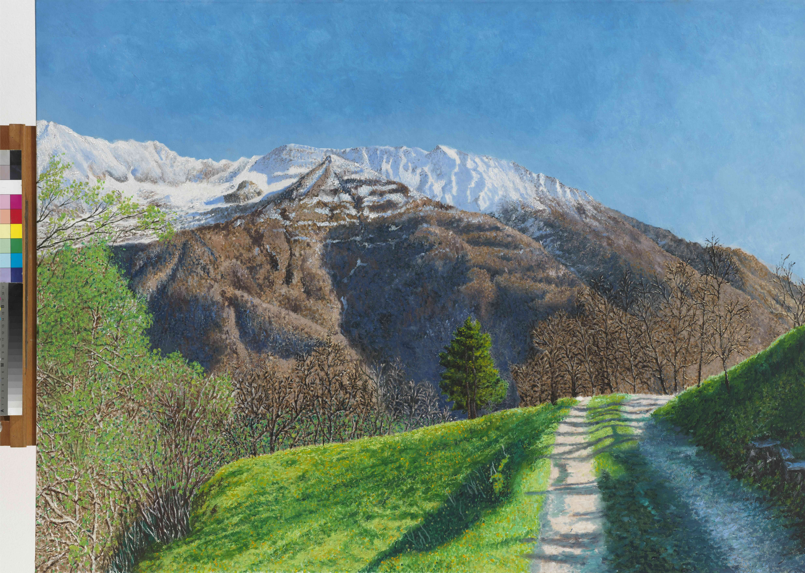

## Trasquera 1

[Download TIFF Image (very large)](https://sigrid-paintings.s3.amazonaws.com/wetransfer_zigrid-photos-tiff-part-1-2_2024-05-31_1621/trasquera1.tif)

Trasquera 1 (Afternoon Walk), 2023

oil on canvas, 90 x 120 cm

A picturesque mountain scene in spring. A path winds through a verdant meadow, leading towards a forest and snow-capped mountains in the distance. 
The blue sky and vibrant vegetation create a beautiful contrast with the snowy peaks.
A winding path through a verdant valley leads towards a snow-capped mountain in this vibrant painting. 
The green grass and trees contrast sharply with the white snow, creating a dynamic scene. 
The path symbolizes a journey through the natural landscape, inviting viewers to explore its beauty.

