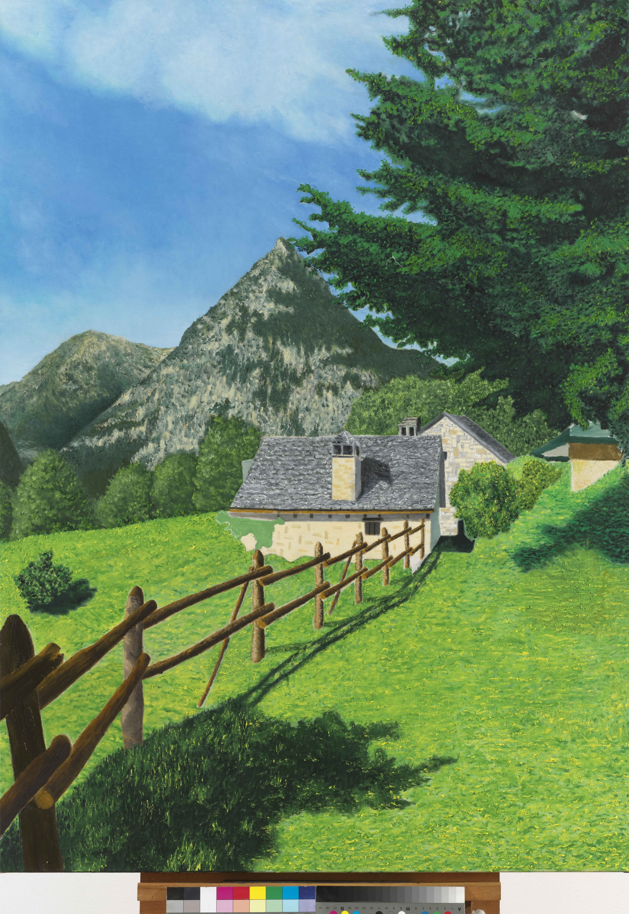

## Trasquera 5 (Bugliaga di Trasquera), 2023

oil on canvas, 120 x 90 cm

A quaint stone cottage is nestled amidst lush greenery in this vibrant painting. 
The bright colors of the grass and trees are complemented by a clear blue sky. 
The detailed fence in the foreground guides the viewer’s eye towards the serene home. 
This work reflects the peaceful simplicity of rural life.

[Download TIFF Image (very large)](https://sigrid-paintings.s3.amazonaws.com/wetransfer_zigrid-photos-tiff-part-1-2_2024-05-31_1621/trasquera5.tif)

