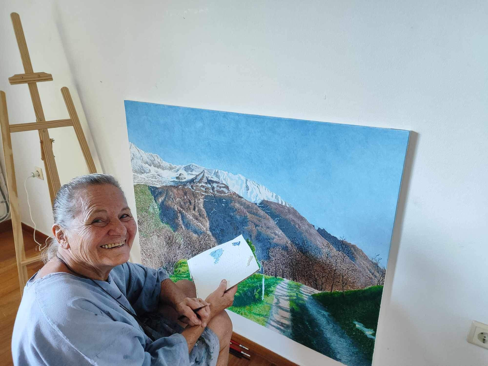
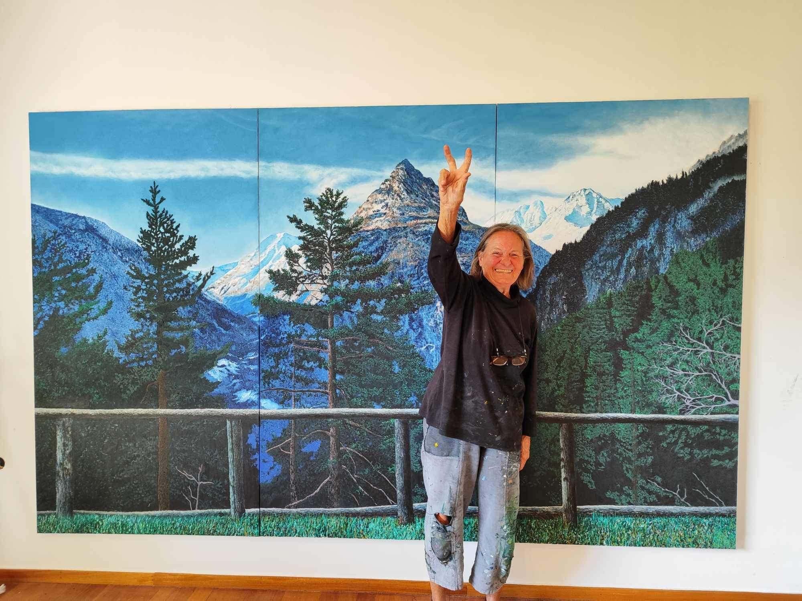
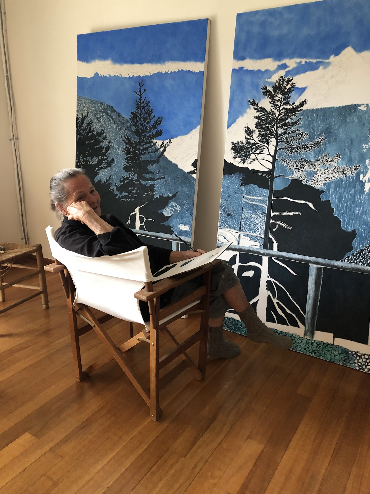
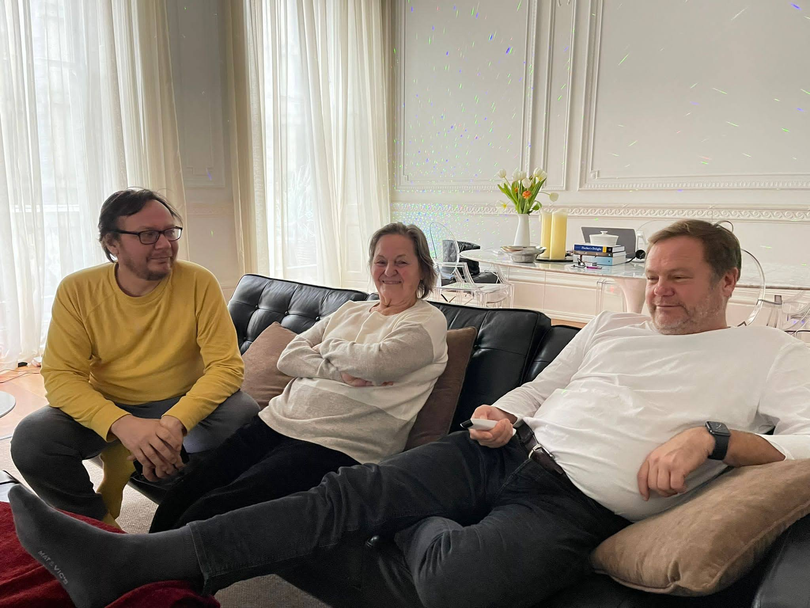
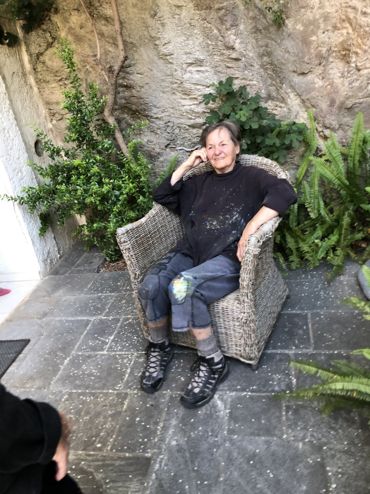
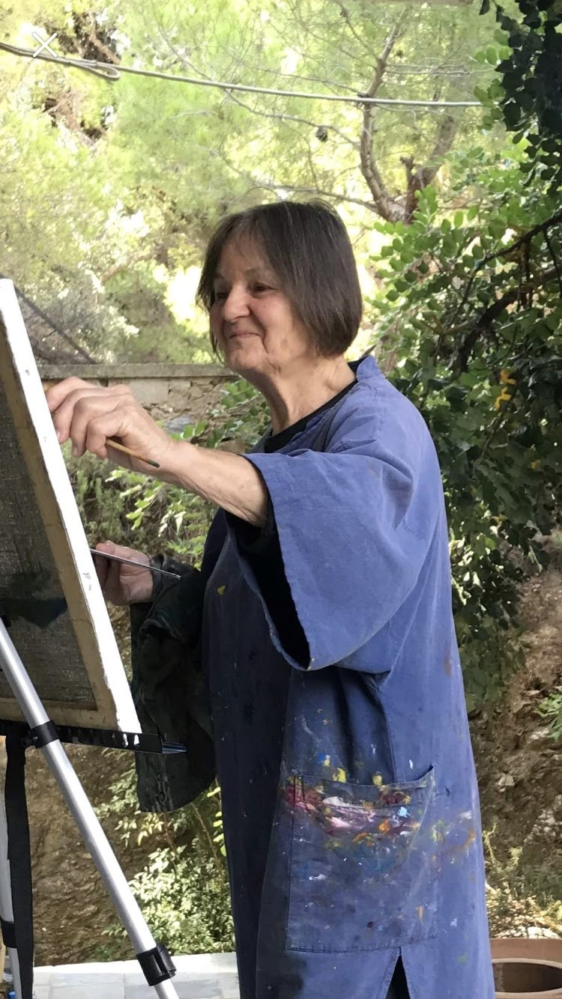
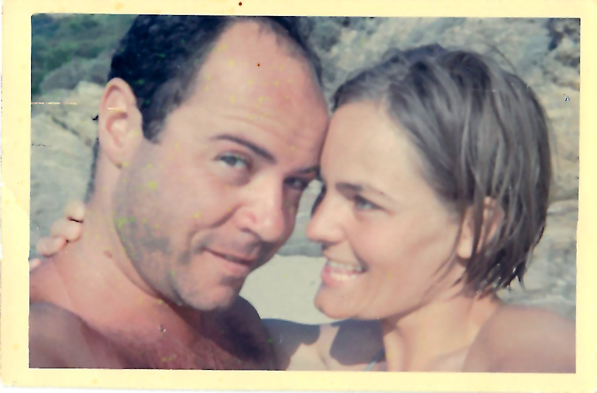

## Sigrid Photos

<html lang="en">
<head>
    <meta charset="UTF-8">
    <meta name="viewport" content="width=device-width, initial-scale=1.0">
    <title>Photos of Sigrid Nassuphis</title>
    
</head>

  <table>
  <tr>
      <th>Image</th>
      <th>Text</th>
  </tr>
  <tr>
      <td></td>
      <td class="text-column">At work.</td>
  </tr>
  <tr>
      <td></td>
      <td class="text-column">With the teacher.</td>
  </tr>
  <tr>
      <td></td>
      <td class="text-column">Funny snaps.</td>
  </tr>
  <tr>
      <td></td>
      <td class="text-column">More funny snaps.</td>
  </tr>
   <tr>
      <td></td>
      <td class="text-column">Completing a work is celebrated.</td>
  </tr>
  <tr>
      <td></td>
      <td class="text-column">A lot of things need to be done.</td>
  </tr>
  <tr>
      <td></td>
      <td class="text-column">Contemplating the work.</td>
  </tr>
  <tr>
      <td></td>
      <td class="text-column">With husband.</td>
  </tr>
  <tr>
      <td></td>
      <td class="text-column">The mountain.</td>
  </tr>
  <tr>
      <td></td>
      <td class="text-column">Visiting sons.</td>
  </tr>
  <tr>
      <td></td>
      <td class="text-column">Rest after work.</td>
  </tr>
  <tr>
      <td></td>
      <td class="text-column">A father's love</td>
  </tr>
  <tr>
      <td></td>
      <td class="text-column">Three kids</td>
  </tr>
  <tr>
      <td></td>
      <td class="text-column">Doing something you love is life.</td>
  </tr>
  <tr>
      <td></td>
      <td class="text-column">Sigrid had just arrived in Greece</td>
  </tr>
</table>
    
    